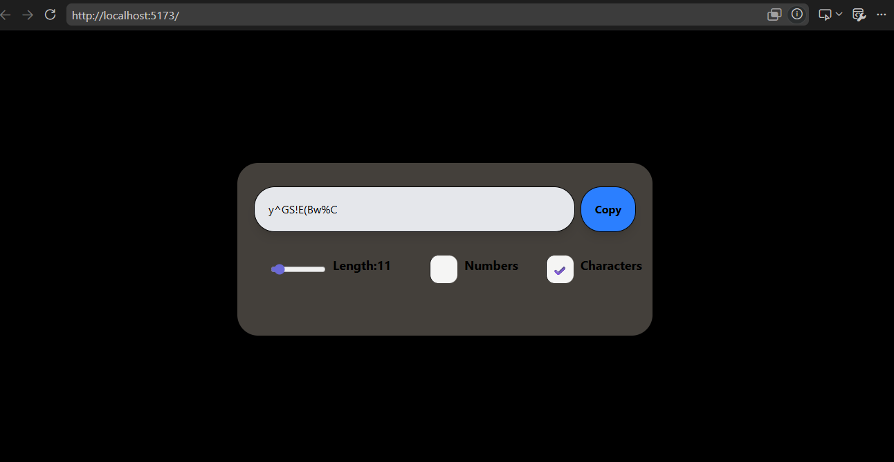

# Password Generator

A simple and responsive Password Generator built with **React**, **Vite**, and **Tailwind CSS**. It generates secure random passwords with customizable options such as password length, numbers, and special characters.

## Features

* Generate random passwords
* Adjustable password length using a slider
* Include/exclude numbers
* Include/exclude special characters
* Copy generated password to clipboard
* Responsive and clean UI

## Tech Stack

* React
* Vite
* Tailwind CSS
* JavaScript (ES6+)

## What I Learned

This project helped me understand several important React concepts:

* Using `useState` to manage component state.
* Using `useEffect` to regenerate the password whenever the selected options change.
* Passing props from parent components to child components.
* Handling events such as button clicks and slider changes.
* Creating controlled components by syncing form inputs with React state.
* Conditional rendering using expressions like:
* Working with reusable React components.
* Using the Clipboard API to copy text:
* Styling components efficiently with Tailwind CSS.

## Challenges Faced

* Understanding React's state updates and re-rendering.
* Making the slider a controlled component.
* Passing data between parent and child components.
* Conditionally rendering the tick mark for selected options.
* Keeping the UI synchronized with the application state.

## Getting Started

Clone the repository:

```bash
git clone <repository-url>
```

Install dependencies:

```bash
npm install
```

Run the development server:

```bash
npm run dev
```

## Preview



---

This project was built as part of my React learning journey to strengthen my understanding of hooks, state management, reusable components, and modern frontend development.


# React + Vite

This template provides a minimal setup to get React working in Vite with HMR and some Oxlint rules.

Currently, two official plugins are available:

- [@vitejs/plugin-react](https://github.com/vitejs/vite-plugin-react/blob/main/packages/plugin-react) uses [Oxc](https://oxc.rs)
- [@vitejs/plugin-react-swc](https://github.com/vitejs/vite-plugin-react/blob/main/packages/plugin-react-swc) uses [SWC](https://swc.rs/)

## React Compiler

The React Compiler is not enabled on this template because of its impact on dev & build performances. To add it, see [this documentation](https://react.dev/learn/react-compiler/installation).

## Expanding the Oxlint configuration

If you are developing a production application, we recommend using TypeScript with type-aware lint rules enabled. Check out the [TS template](https://github.com/vitejs/vite/tree/main/packages/create-vite/template-react-ts) for information on how to integrate TypeScript and Oxlint's TypeScript related rules in your project.
