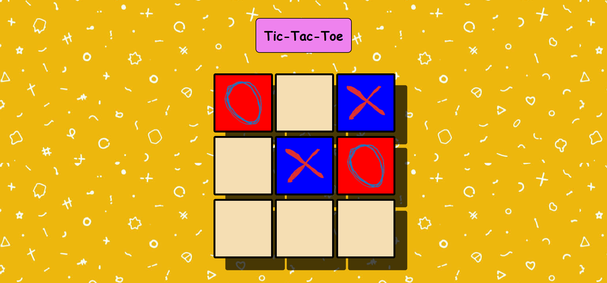

# Tic Tac Toe

A classic two-player Tic Tac Toe game built using **HTML**, **CSS**, and **Vanilla JavaScript**. This project was built from scratch to strengthen my understanding of DOM manipulation, event handling, and game logic.

---

## Features

- Two-player gameplay
- Interactive click-based game board
- Custom game symbols using images
- Prevents overwriting occupied cells
- Automatic win detection
- Draw detection
- Hover effects and UI interactions

---

## Tech Stack

- HTML5
- CSS3
- JavaScript (ES6)

---

## Project Structure

```
Tic Tac Toe/
│
├── images/
│   ├── stars.png
│   ├── zeroes.png
│   └── ...
│
├── index.html
├── index.css
├── index.js
├── README.md
└── .gitignore
```

---

## Concepts Practiced

This project helped me practice:

- DOM Manipulation
- Event Listeners
- JavaScript Arrays
- Game State Management
- Conditional Logic
- Looping through Data
- CSS Styling and Animations

---

## Getting Started

1. Clone the repository:

```bash
git clone <repository-url>
```

2. Open the project folder.

3. Open `index.html` in your preferred web browser.

No additional dependencies or installation are required.

---

## Future Improvements

- Game over popup
- Replay button
- Scoreboard
- Highlight winning combination
- Sound effects
- Responsive design improvements
- Single-player mode (AI)

---

## Preview

## Author

**Varun Chauhan**